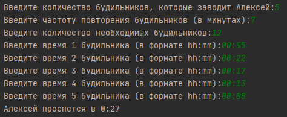
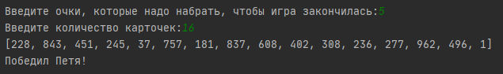

# PYTHON BASICS HW1

### Prepared by Lidziya Vitushka

#### A. Будильники

Решение задачи представлено в файле Task_A_Alarm_Clock.py.

Созданы три функции:

Function name                               | Description           
--------------------------------------------|------------------------------
sanity_check(string)                        | Функция для проверки корректности ввода данных, которые должны содержать только положительные целочисленные числа. В качестве параметра принимает строку, содержащую сообщение для пользователя о том, какую именно переменную он должен ввести
time_check(string)                          | Функция для проверки корректности ввода данных, которые должны содержать только время в формате hh:mm. В качестве параметра принимает строку, содержащую сообщение для пользователя о том, какую именно переменную он должен ввести
count_alarms_in_defined_time(int, int, int) | Функция для рассчета количества срабатываний конкретного будильника в заданный момент времени. В качестве параметров принимает первое время срабатывания будильника, заданный момент времени и частоту срабатывания будильника

Чтобы не учитывать будильники, чей остаток от деления первого времени срабатывания на период срабатываний совпадает, список первых срабатываний сортируется по убыванию величин (чтобы при перезаписываний значений в словаре последним остался будильник, срабатывающий раньше остальных) и данные из него записываются в словарь, ключ которого - остаток от деления, а значение - первое время срабатывания. 

Удаляем из первоначального списка времен первых срабатываний все значения, которые не входят во множество значений словаря и в цикле для каждой минуты в сутках рассчитываем количество будильников, сработавших на эту минуту до тех пор, пока количество отработавших будильников не превышает количество будильников, от которых проснется Алексей.

#### С. Интересная игра

Решение задачи представлено в файле Task_C_Interesting_Game.py.

Созданы две функции:

Function name                               | Description           
--------------------------------------------|------------------------------
sanity_check(string)                        | Функция для проверки корректности ввода данных, которые должны содержать только положительные целочисленные числа. В качестве параметра принимает строку, содержащую сообщение для пользователя о том, какую именно переменную он должен ввести
interesting_game(int, int)                  | Функция, содержащая основную логику. На вход принимает очки, необходимые для победы, а также количество карточек. 

Целые числа для карточек генерируются псевдослучайно при помощу модуля random от 0 до 1000. Далее выполняется последовательный обход всех значений. Если остаток от деления числа на 5 равен нулю и остаток от деления на 3 не равен нулю, то Вася получает очко. Если остаток от деления числа на 3 равен нулю и остаток от деления на 5 не равен нулю, то Петя получает очко.

Если кто-то из ребят набрал количество отчков, необходимое для победы, то цикл прерывается досрочно.

Далее следует вывод с сообщением имени победителя. Победителем считается тот, у кого на момент завершения работы цикла наибольшее количество очков (даже если никто не смог набрать очки, необходимые для победы). В случае равенства очков выводится сообщение о ничьей.

